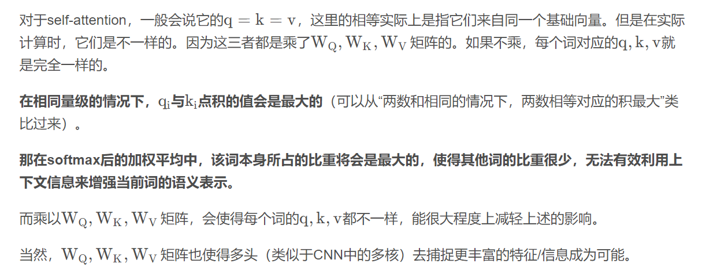

# 面试题

## 旷视面试

1. 手写iou,nms

```python
import cv2
import numpy as np

def iou(box1, box2):
    x1 = max(box1[0], box2[0])
    y1 = max(box1[1], box2[1])
    x2 = min(box1[2], box2[2])
    y2 = min(box1[3], box2[3])
    h = max(0, x2-x1)
    w = max(0, y2-y1)
    area1 = (box1[2]-box1[0])*(box1[3]-box1[1])
    area2 = (box2[2]-box2[0])*(box2[3]-box2[1])
    return (w*h)/(area1+area2-w*h)

def nms(boxes, thres):
    x1 = boxes[:, 0]
    y1 = boxes[:, 1]
    x2 = boxes[:, 2]
    y2 = boxes[:, 3]
    scores = boxes[:, 4]
    orders = scores.argsort()[::-1]
    keep = []
    areas = (x2-x1)*(y2-y1)
    while(orders.size()>0):
        index1 = orders[0]
        keep.append(index1)
        xx1 = np.maximum(x1[index1], x1[orders[1:]])
        yy1 = np.maximum(y1[index1], y1[orders[1:]])
        xx2 = np.minimum(x2[index1], x2[orders[1:]])
        yy2 = np.minimum(y2[index1], y2[orders[1:]])
        w = np.maximum(0.0, xx2-xx1+1)
        h = np.maximum(0.0, yy2-yy1+1)
        iter = w*h
        ious = iter/areas[index1]+areas[orders[1:]]-iter
        ids = np.where(ious<=thres)[0]
        orders = orders[ids+1]
    
    return keep
```

2. 跳台阶
3. 跳台阶进阶
4. 缓解过拟合的方法
5. C++多态
6. dropout
7. BN

## 京东面试

1. 动态规划的转移方程

2. resnet的神经元的细节，数学表达

   1. shortcut
   2. F(x)+x

3. 聚类算法

   1. kmeans过程

   2. kmeans有哪些缺点

      1. k值难以估计

      一开始确定一个合适的k值，通过一次kmeans聚类得到k个聚类中心，根据k个聚类中心之间的距离情况合并距离近的类别，直到达到阈值收敛

      2. 对噪声和离群点敏感

      去除离群点后再进行聚类

      3. 对初始聚类中心敏感

      已经选取了若干聚类中心，距离这些聚类中心越远的点越有可能被选为新的聚类中心

   3. 其他的一些聚类算法（密度）

4. SVM

   1. 过程
   2. 除了软间隔之外，线性不可分怎么解决
   3. 软间隔中对偶问题怎么解决
      1. 拉格朗日乘子法
   4. 对偶问题转换需要满足的条件
      1. KKT条件
   5. KKT条件
      1. 拉格朗日函数取极值的的一个必要条件
      2. 拉格朗日系数约束
      3. 不等式约束
      4. 互补松弛条件
      5. 原约束

5. 解决过拟合的一些方法

6. transformer

   1. 模型过程
   2. 讲一下注意力机制

7. 项目内容

8. 两道算法

   1. 一个数组里面有一个数出现的次数大于等于数组长度的一半，找出这个数（空间复杂度O（1），时间复杂度O（n））

   ```cpp
   class Solution {
   public:
       int majorityElement(vector<int>& nums) {
           int cnt = 0;
           int ans = 0;
           for(auto val: nums) {
               if(cnt==0) {
                   ans = val;
                   cnt++;
               } else {
                   if(ans==val)
                       cnt++;
                   else
                       cnt--;
               }
           }
           return ans;
       }
   };
   ```

   2. 全排列

## 蔚来

1. attention和全连接的区别
2. Vision transformer的位置编码具体实现
3. 注意力机制
4. 注意力机制为什么要除以d
5. 最新的前沿进展
6. 为什么注意力机制要生成q,k,v，单独一个不行吗



1. 项目中数据均衡是怎么做的
2. 算法题：马走遍所有的点有几种不同的途径
